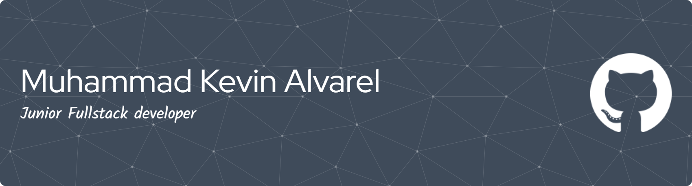

## Hi there, I'm Kevin! 👋

I'm **Muhammad Kevin Alvarel**, a passionate **Front-End Engineer** and Informatics Student from Indonesia 🇮🇩.  
I specialize in building modern web interfaces and am currently expanding my skills into Mobile Development and Cloud Computing.

## 🚀 About Me

- 🎓 **Informatics Student** with a strong background in Computer & Network Engineering (TKJ).
- 💼 Working as a **Front-End Engineer**, focused on creating responsive & performant web apps.
- 🏛️ **Founder & Lead** of Dicoding Community Network at Universitas Al-Khairiyah (DCN Unival).
- 🌟 **Alumni Google Student Ambassador** (Class of 2025).
- 💻 Selected for **Coding Camp 2026 powered by DBS Foundation** (Full Stack Path).

## 🌱 Current Focus

- **Learning:** Mobile Development (Flutter/Dart), Google Cloud Platform (GCP), and Advanced Next.js 15.
- **Exploring:** Generative AI integration (Gemini & NotebookLM) into web applications.

## 🏆 Certifications & Badges

- **Google Cloud:** Essential Google Cloud Infrastructure: Foundation
- **Google:** Gemini Certified Educator
- **Skill Badge:** Develop GenAI Apps with Gemini and Streamlit

## 🌐 Socials

 

---

# 💻 Tech Stack

### Languages

    

### Frontend & Mobile

    

### Backend & Cloud

    

### Deployment & Tools

  

---

